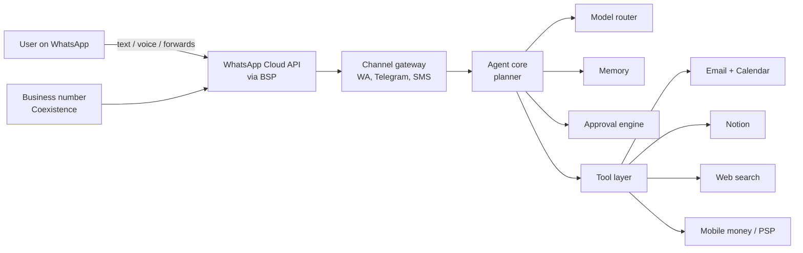
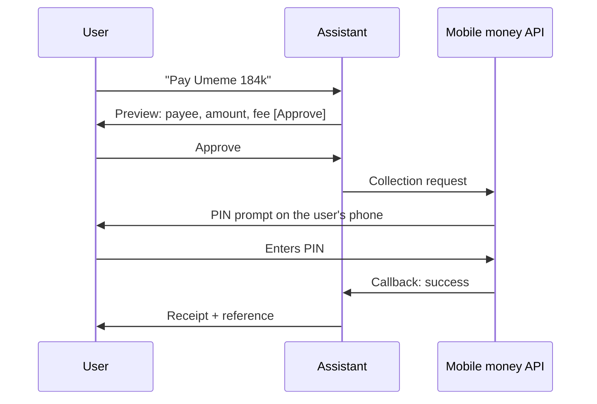

# PRD: WhatsApp-Native AI Assistant

Sep 18, 2026 · @Elias · Status: Draft v0.1

## TL;DR and key decisions

**We build on official channels only: a WhatsApp-first task assistant with no native app required.** WhatsApp is where the user talks to the assistant. A web page handles one-time setup, such as connecting accounts. Business mode is the lead product, because it is the use Meta explicitly allows.

**Decisions**

| # | Decision | Why |
| --- | --- | --- |
| D1 | **No unofficial WhatsApp access.** No linked-device or WhatsApp Web libraries such as Baileys, OpenClaw or whatsmeow, and no reading the user's personal chats or groups. | Breaks WhatsApp's Terms, risks banning the user's own number, and scares off investors and partners. |
| D2 | **No call recording.** Calls are summarised from a voice-note debrief the user sends afterwards. | No API exists, iOS and Android block call capture, and consent rules vary by country. |
| D3 | **No Android companion app in v1.** | It could only see notifications (no history, no iOS), and it adds privacy review and Play Store risk for little gain. |
| D4 | **Model-agnostic.** Claude, GPT or Gemini for reasoning, small models for routing, and local-language speech models. | Meta's policy is about what the product *is*, not whose model it runs. Routing by task controls cost. |
| D5 | **Positioned as a task assistant, not a general chatbot.** Web lookups are always tied to a task. | Meta bars providers whose *primary* function is a general-purpose AI assistant. |
| D6 | **Channel-agnostic backend** with Telegram, SMS and our own app as fallbacks. | Keeps the product alive if WhatsApp access changes. |

**What the assistant can see:**

- the user's email, calendar and Notion, connected through OAuth
- anything the user sends it: text, voice notes, forwarded messages, documents and screenshots
- a business's client chats, when the business number is officially connected

It never reads the user's personal WhatsApp inbox.

## Problem, users and vision

**Problem.** Busy professionals in WhatsApp-first markets juggle dozens of chats and groups, an email inbox, a calendar and mobile money. Existing assistants live in separate apps, are built for desktop and email-first work, and don't understand mobile money or group-chat-heavy workflows. So users context-switch all day, and things that need their attention get lost in group noise.

**Vision.** One contact in WhatsApp that knows what needs the user's attention and gets things done, in the same place they already spend their day.

**Target users**

| Persona | Example | Top jobs to be done |
| --- | --- | --- |
| Busy professional | Founder, manager or consultant in Kampala, Nairobi or Lagos | "What needs my attention?", schedule meetings, triage email, pay bills |
| WhatsApp-first seller | Boutique, caterer or salon selling through the WhatsApp Business app | Reply to clients fast, track orders, share a catalogue, collect payment |
| Executive assistant (secondary) | EA managing one or more principals | Calendar, follow-ups, drafting on behalf of the principal |

**Design principles**

- **Chat is the interface.** Every flow completes inside WhatsApp. Web pages are only for one-time setup such as OAuth.
- **Voice is first-class.** Users can speak any instruction, and the assistant can reply by voice.
- **The assistant proposes; the user approves.** Nothing is sent, paid or booked without an explicit confirmation, unless the user has set a rule for it.
- **Official platforms only.** We never touch data the user hasn't connected or sent to us, and we use no unofficial clients.
- **Low bandwidth.** Keep replies short, send media only when needed, and handle patchy networks gracefully.

## Goals, non-goals and success metrics

**Goals (v1)**

1. A daily and on-demand "what needs my attention" brief covering email, calendar, tasks, bills and (in business mode) client chats.
2. The assistant can complete at least 5 action types end to end from chat: schedule an event, send an email reply, write to Notion, pay a bill or merchant, and look up a web answer for a task.
3. Voice parity: every text command also works as a voice note.
4. A business mode where a seller can go live with a catalogue and AI-assisted replies in under 15 minutes.

**Non-goals (v1)**

- Reading the user's personal WhatsApp chats or groups by any means: unofficial clients, linked devices or notification readers.
- Recording or live-transcribing phone or WhatsApp calls.
- A native companion app in v1.
- Open-ended general chat (trivia, companionship, homework help). The assistant stays focused on tasks.
- Acting fully autonomously on money or outbound messages. Every payment and every message sent in the user's name needs approval.

**Success metrics** (targets are placeholders to set after the pilot)

| Metric | Definition | Pilot target |
| --- | --- | --- |
| Activation | Share of new users who connect 2 or more integrations within 24 h | ≥ 50% |
| Weekly actions per active user | Actions completed and approved (sent, booked, paid, saved) | ≥ 10 |
| Brief engagement | Share of daily briefs followed by a reply or action within 2 h | ≥ 40% |
| Draft acceptance | Share of drafts sent unedited or with minor edits | ≥ 60% |
| Payment success | Approved payments that settle without error | ≥ 98% |
| W4 retention | Share of users active in week 4 | ≥ 35% |
| Unit cost | LLM + WhatsApp + speech cost per monthly active user | Below price minus 60% gross margin |

## Platform constraints

The assistant is a WhatsApp Business number on the Cloud API, so it only sees messages users send **to it**. Everything else has to be connected officially.

| Constraint | What it means for us |
| --- | --- |
| [AI-provider clause](https://www.whatsapp.com/legal/business-solution-terms), WhatsApp Business Solution Terms (in force for all users from 15 Jan 2026) | The API is barred to AI tools, including "general-purpose artificial intelligence assistants", when AI is the "primary (rather than incidental or ancillary) functionality". Meta decides "in its sole discretion". **This applies whatever model we use.** Exception: users with EEA or Brazil phone numbers only. |
| [No training on WhatsApp data](https://www.whatsapp.com/legal/business-solution-terms) | WhatsApp data, even anonymised or aggregated, cannot be used to train or improve any AI model. Fine-tuning a model for our own exclusive use is allowed. Model vendors must be on no-training, zero-retention terms. |
| [EU paid access](https://techcrunch.com/2026/03/05/meta-will-allow-rival-ai-chatbots-on-whatsapp-in-europe-but-for-a-fee/) (Mar 2026) | Europe only: Meta charges €0.049–€0.132 per non-template message. Nothing similar has been announced for African markets. |
| 24-hour customer service window | Free-form replies are allowed only within 24 h of the user's last message. Briefs sent outside that window must use paid, pre-approved templates. |
| No API into personal accounts or calls | By design (D1, D2), inbox content comes only from what users forward, and call notes come from voice-note debriefs. |
| [Coexistence](https://developers.facebook.com/documentation/business-messaging/whatsapp/embedded-signup/onboarding-business-app-users) (business numbers) | Official. Syncs 180 days of 1:1 history (media for the first 14 days only) and echoes messages sent from the app through a webhook. **No groups.** Fixed 20 msg/s. Disables broadcast lists, disappearing messages and view-once. History must be synced within 24 h of onboarding. |
| [Cloud API Calling](https://developers.facebook.com/documentation/business-messaging/whatsapp/calling) | Users can call the assistant over WhatsApp, which could power live voice mode later. It gives no access to the user's other calls. |
| WhatsApp Pay | Not available in Uganda or Kenya. Payments go through mobile money and card PSPs. |

**Implementation notes.** Cloud API mechanics (account setup, webhook verification and payload shapes, sending, media, the 24-hour window and templates, Coexistence, error codes, local testing) live in [`docs/whatsapp-notes.md`](whatsapp-notes.md).

**Competitors that take the unofficial route.** Perisclaw offers full WhatsApp inbox summaries by linking to the user's account as a device, [built on OpenClaw's Baileys client](https://openclaw-openclaw.mintlify.app/channels/whatsapp). Its [own blog](https://www.perisclaw.com/blog/openclaw-for-whatsapp-how-to-set-it-up-and-why-most-setups-break) warns that accounts can be flagged or restricted, and advises using a spare number. That is our differentiation: the same convenience for email, calendar, payments and business chats, with no ban risk to the user's real number.

## Recommended architecture

The design has a channel-agnostic agent core, WhatsApp as the main channel, official OAuth connectors for each service, and a model router that sends each task to the cheapest model that can handle it. There is no native app.

The gateway normalises messages from any channel, so losing access to WhatsApp would cost us a channel, not the product.

**Components**

| Component | Responsibility | Suggested stack |
| --- | --- | --- |
| Channel gateway | Webhooks, 24 h window tracking, templates, interactive buttons and Flows, media download | Cloud API through a BSP (360dialog, Twilio, Infobip) or direct |
| Speech | Transcribe voice notes (with English, Luganda and Swahili code-switching) and generate voice replies | See model plan |
| Agent core | Intent parsing, planning, tool calls, drafting in the user's tone | See model plan |
| Memory | Per-user contacts, preferences, priority rules, an index of connected email and forwarded content | Postgres + pgvector; encrypted per tenant |
| Connectors | OAuth tokens and scoped API calls | Gmail/Graph, Google/Outlook Calendar, Notion API, MCP servers where available |
| Approval engine | Risk policy per action, confirmation prompts, spend limits, audit log | In-house; step-up auth for payments |
| Scheduler | Daily briefs, reminders, follow-up nudges (sent as templates outside the 24 h window) | Queue + cron |
| Web onboarding | Sign-up, OAuth consent, settings, data export and delete | Lightweight PWA, opened from WhatsApp links |

**Model plan** (model-agnostic: any vendor can be swapped out behind the router)

| Job | Model tier | Candidates | Selection test |
| --- | --- | --- | --- |
| Planning, tool use, drafting, payment intent | Frontier | Claude, GPT, Gemini | Tool-call accuracy on 200 real scripted tasks; draft acceptance |
| Routing, classification, short summaries | Small and fast | Claude Haiku, GPT mini, Gemini Flash, or open-weight | Latency under 1 s; cost per 1k messages |
| Speech-to-text | ASR | Whisper-class models vs local models, e.g. Sunbird AI (Ugandan languages) | Word error rate on 500 real code-switched voice notes |
| Voice replies | TTS | Vendors with natural East African voices | User preference test |

All vendors must be on zero-retention, no-training terms, as the WhatsApp Terms require.

## Functional requirements

P0 = MVP, P1 = phase 2, P2 = later. Every write action goes through the approval engine.

| ID | Capability | Requirement | How it is delivered | Priority |
| --- | --- | --- | --- | --- |
| F1 | Onboarding | Sign up from a wa.me link. Connect services through OAuth links, and set a timezone, language and brief time. | WhatsApp + web PWA | P0 |
| F2 | Voice in | Accept voice notes up to 5 min. Transcribe them, confirm the transcript for risky actions, and support code-switched speech. | Cloud API media + ASR | P0 |
| F3 | Voice and text out | Reply in the same mode the user used by default, with a setting to change it. Voice replies stay under 60 s. | TTS → audio message | P0 |
| F4 | Email summary | Morning brief plus on-demand "what's important in my inbox", ranked by sender importance, deadlines and asks. | Gmail / Microsoft Graph | P0 |
| F5 | Drafting | Draft email replies, and replies to messages the user forwards. Offer edit, send or copy as buttons; the user pastes WhatsApp replies into their own chat. | LLM + memory | P0 |
| F6 | Calendar | Create, move and cancel events. Check for conflicts, propose times and send invites. "Book 30 min with Sarah Thursday" should just work. | Google / Outlook Calendar | P0 |
| F7 | Task-scoped web lookup | Answer questions tied to a task, with sources; for example, "find a venue near Kololo for 20 people". No open-ended chit-chat. | Search API + fetch | P0 |
| F8 | Notion | Save notes, tasks and meeting summaries to a chosen database, and query pages. | Notion API | P0 |
| F9 | Forward-to-summarise | The user forwards messages, or exports a group chat, to the assistant. It extracts asks, deadlines and decisions, then offers to draft a reply, add a task or book a meeting. | WhatsApp forwards / .txt export | P0 |
| F10 | Call debrief | After a call, the user sends a voice note ("Just spoke to Kato…"). The assistant turns it into decisions and action items and pushes them to Notion or the calendar. | Voice note + ASR | P0 |
| F11 | Payments | Pay a merchant, bill or person after explicit approval, with daily limits and receipts in chat. | MTN MoMo / Airtel Money APIs or an aggregator (e.g. Flutterwave, Pesapal) | P1 |
| F12 | Orders and online actions | Order food, book rides, buy airtime or data, pay utilities. | Partner APIs | P1–P2 |
| F13 | Rules and routines | "Always remind me of unpaid invoices on Friday", "auto-accept meetings from my co-founder". | Scheduler + policy | P1 |
| F14 | Meeting notes for video calls | Pull transcripts from Google Meet, Zoom or Teams where the user's workspace already records them. | Meet / Zoom / Graph APIs | P2 |
| F15 | Live voice mode | Call the assistant over WhatsApp and talk in real time. | Cloud API Calling (WebRTC) | P2 |

**Example interaction**

> **User (voice):** "What's urgent today, and move my 3pm to tomorrow."
>
> **Assistant:** "3 things: (1) The Stanbic loan officer emailed — signed docs needed by 5pm. (2) You told me after your call with Amina that she needs the Q3 deck by today. (3) Umeme bill UGX 184,000 due tomorrow. Your 3pm with Kato can move to tomorrow at 3pm or 4:30pm. \[3pm\] \[4:30pm\] \[Keep\]"

## WhatsApp Business mode

This is the fully official, lowest-risk part of the product. The seller connects their own Business number through Embedded Signup with Coexistence, keeps using the WhatsApp Business app, and the assistant works alongside them. Automating customer support and orders is explicitly allowed under Meta's policy.

**Setup flow (target under 15 min)**

1. The seller messages the assistant: "Set up my shop."
2. The assistant sends an Embedded Signup link. The seller scans a QR code in the Business app, and 180 days of 1:1 history syncs.
3. The assistant asks for products by photo, voice or a price list. It builds the catalogue (names, prices in UGX, descriptions) and asks for approval.
4. The catalogue is pushed through the Catalog / Commerce API. The seller gets a shareable shop link and a QR poster.
5. The seller chooses a reply mode: *draft for approval* (default), *auto-reply to FAQs only*, or *full auto within business hours*.

**Requirements**

| ID | Requirement | Priority |
| --- | --- | --- |
| B1 | Client list built automatically from chats: name, last order, total spent, tags (VIP, wholesale, overdue) | P0 |
| B2 | AI-drafted replies to client messages, grounded in the catalogue, prices, stock and FAQs; seller approves from their personal WhatsApp | P0 |
| B3 | Order capture from chat into a simple order record (items, amount, delivery, status) | P0 |
| B4 | Payment requests through mobile money links; status auto-updates on payment callback | P1 |
| B5 | Daily seller brief: new leads, unanswered chats, unpaid orders, low stock | P1 |
| B6 | Broadcast and re-engagement campaigns through approved marketing templates (sent from the API side, since Coexistence disables app broadcast lists) | P1 |
| B7 | Human handoff: the assistant stops as soon as the seller replies from the app (detected through message echoes) | P0 |

**Known gap:** Coexistence does not cover group chats. Sellers who take orders in groups can forward order messages to the assistant (F9), or send buyers to the shop link.

## Trust, safety, payments and compliance

The approval engine sorts every action into a risk tier, and the tier decides what confirmation is needed.

| Tier | Examples | Confirmation |
| --- | --- | --- |
| Read | Summarise, search, look up | None |
| Low write | Save to Notion, create a private calendar hold | None, but undoable for 10 min |
| Outbound comms | Send an email or message, send an invite | Preview + \[Send\] button |
| Money | Payments, orders | Preview (payee, amount, fee) + \[Approve\] + PIN or OTP step-up; daily and per-transaction limits |

The user enters their PIN on the mobile money prompt, never in WhatsApp. That keeps the assistant out of custody of credentials and funds.

**Security and privacy requirements**

- Encrypt OAuth tokens with per-user keys in a KMS. Request the narrowest scopes possible (for example, Gmail read plus draft rather than full mailbox access).
- Prompt injection: any instruction that comes from *content* (an email, a forwarded message or a document) never triggers a write action without the user's approval.
- No training: no WhatsApp-derived data is used to train or improve any model, ours or a vendor's. This is required by WhatsApp's Terms. Vendors must be under zero-retention contracts.
- Data retention: forwarded content and raw message bodies are kept for 30 days by default. Users can say "forget everything" and get a full export and deletion from the web settings.
- Third parties in forwarded messages have not consented. Minimise their data, don't build profiles of them, and never message them without the user's approval.
- Compliance: Uganda Data Protection and Privacy Act 2019, Kenya DPA 2019, Nigeria NDPA 2023, and GDPR for EU users. Payments must go through a licensed PSP. Registration with the relevant data protection regulator is needed before launch.

## Roadmap, risks and open questions

**Phased roadmap** (durations assume a team of 3–4 engineers)

| Phase | Scope | Duration |
| --- | --- | --- |
| 0: Validate | Policy review with a BSP against the AI-provider clause; concierge pilot with 20 users and 10 sellers; benchmark ASR and models on local voice notes | 3–4 weeks |
| 1: MVP | Business mode B1–B3 and B7; personal F1–F10 (voice, email, calendar, drafting, Notion, task-scoped web, forward-to-summarise, call debrief) | 8–10 weeks |
| 2: Actions | Payments (F11, B4), rules (F13), seller brief and campaigns (B5, B6) | 8 weeks |
| 3: Expand | Orders (F12), video meeting notes (F14), live voice (F15), Kenya and Nigeria rollout | Ongoing |

**Top risks**

| Risk | Likelihood | Impact | Mitigation |
| --- | --- | --- | --- |
| Meta classifies us as an "AI provider" whose primary function is a general-purpose assistant | Medium | Critical | Task-assistant positioning (D5), business mode first, BSP sign-off before launch, channel-agnostic gateway (D6) |
| Users expect full WhatsApp inbox summaries, which competitors like Perisclaw offer | High | Medium | Make safety the pitch ("your number is never at risk"); make forwarding a one-tap habit; lead with email, calendar and payments |
| Forwarding is too much friction, so the brief feels thin | Medium | Medium | Measure forwards per user per week in the pilot; a strong email and calendar brief carries the product on its own |
| Template and LLM costs erode margin | Medium | Medium | Model router, batched briefs, bringing users back inside the free 24 h window |
| Payment errors or fraud | Low–medium | High | PSP-hosted PIN, limits, velocity checks, full audit log |

**Open questions**

- [ ] Which BSP will review our use case against the AI-provider clause, and what exactly would they sign off on?
- [ ] Launch personal mode and business mode together, or business mode first?
- [ ] Pricing: per-user subscription (for example, UGX 20–40k/month) vs a free tier with paid actions? Business mode priced per seat or per conversation?
- [ ] Which mobile money aggregator covers Uganda, Kenya and Nigeria with a single integration?
- [ ] Which frontier model wins our tool-use benchmark on cost vs accuracy, and does Sunbird-class ASR beat Whisper on Luganda code-switching?

### Sources

- [WhatsApp Business Solution Terms (AI-provider clause, training restriction)](https://www.whatsapp.com/legal/business-solution-terms)
- [respond.io — WhatsApp's 2026 AI policy explained](https://respond.io/blog/whatsapp-general-purpose-chatbots-ban)
- [European Commission — interim measures on WhatsApp AI access](https://ec.europa.eu/commission/presscorner/detail/en/ip_26_1276)
- [TechCrunch — Meta allows rival AI chatbots in Europe for a fee (5 Mar 2026)](https://techcrunch.com/2026/03/05/meta-will-allow-rival-ai-chatbots-on-whatsapp-in-europe-but-for-a-fee/)
- [Meta for Developers — Onboard WhatsApp Business app users (Coexistence)](https://developers.facebook.com/documentation/business-messaging/whatsapp/embedded-signup/onboarding-business-app-users)
- [Meta for Developers — Cloud API Calling](https://developers.facebook.com/documentation/business-messaging/whatsapp/calling)
- [Perisclaw — OpenClaw for WhatsApp: setup and why setups break](https://www.perisclaw.com/blog/openclaw-for-whatsapp-how-to-set-it-up-and-why-most-setups-break)
- [OpenClaw docs — WhatsApp channel (Baileys)](https://openclaw-openclaw.mintlify.app/channels/whatsapp)

Notes on WhatsApp Pay availability, mobile money APIs and Sunbird AI's speech models come from general knowledge and should be verified before build.
